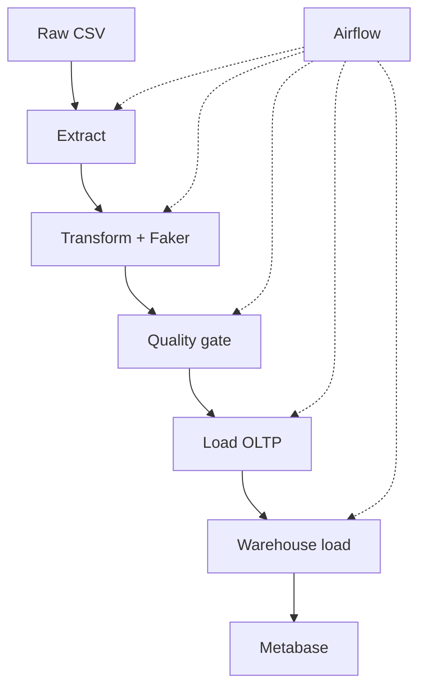

# Football Data Warehouse Pipeline

An end-to-end data engineering pipeline that extracts European football league standings, transforms and validates the data, incrementally augments it with Faker-generated synthetic records, loads it into a normalized OLTP database, and builds a star-schema warehouse for analytics ??? orchestrated with Airflow and visualized in Metabase.

## Architecture

The pipeline consists of five stages:

1. **Extract** ??? reads the raw standings CSV, validates expected columns, logs row counts

2. **Transform** ??? cleans messy scorer/goalkeeper fields, maps country codes to league names, and generates a new batch of synthetic rows with Faker each run (incremental, watermark-tracked ??? see below)

3. **Quality Gate** ??? 5 automated checks: null, range, consistency, uniqueness, referential integrity. A failed check aborts the load ??? bad data never reaches the database

4. **Load (OLTP)** ??? idempotent upserts into a normalized PostgreSQL schema. Safe to re-run without creating duplicates

5. **Warehouse Load** ??? reads from OLTP, populates a star schema: one fact table, four dimensions (team, season, player, date)

## Data Flow

## Incremental Watermark Loading

A \`pipeline_watermark\` table tracks the last successful run's timestamp, cumulative row count, and synthetic data seed position. Each pipeline run reads this watermark and generates only a **new batch** of synthetic rows continuing from where the last run left off ??? rather than regenerating the full dataset every time. This means:

- Re-running the pipeline grows the dataset incrementally (a configurable batch size per run)
- No duplicate or repeated synthetic rows across runs
- The current baseline dataset is ~14,000+ rows, with each subsequent run adding more
- Each row in `team_season_stats` is tagged with a `source` column (`real` or `synthetic`), making it easy to distinguish the  original   98 rows from generated data.

## Orchestration & Visualization
- **Airflow** ??? orchestrates the full pipeline daily, with automatic retries (DAG: \`football_etl\`)
- **Metabase** ??? dashboards built on top of the warehouse for analytics
- **DBeaver** ??? used for inspecting and querying both databases

## Project Structure
- \`pipeline/\` - extract, transform, quality, load, warehouse_load, generate_synthetic
- \`sql/migrations/\` - numbered SQL migration files (OLTP schema)
- \`sql/\` - warehouse schema DDL
- \`dags/\` - Airflow DAG definition
- \`tests/\` - pytest test suite
- \`data/raw/\` - source CSV
- \`logs/\` - run logs
- \`docs/\` - architecture diagram
- \`docker-compose.yml\` - Postgres, Airflow, and Metabase services
- \`Dockerfile.airflow\` - custom Airflow image with pipeline dependencies

## Setup
1. Clone the repo
2. Copy \`.env.example\` to \`.env\` and fill in your own values
3. Start the stack:
   \`\`\`sh
   docker compose up -d
   \`\`\`
4. Run migrations to build the OLTP schema:
   \`\`\`sh
   python pipeline/run_migrations.py
   \`\`\`
5. Run the warehouse schema SQL (\`sql/warehouse_schema.sql\`) against the \`football_dwh\` database
6. Load the data:
   \`\`\`sh
   python -m pipeline.load
   python -m pipeline.warehouse_load
   \`\`\`
7. Access Airflow at http://localhost:8081 and Metabase at http://localhost:3000

## Data Quality Checks
- Null check on required fields
- Range check (e.g. points-per-match <= 3.0, matches played <= 38)
- Consistency check (W+D+L = MP, GD = GF-GA)
- Uniqueness check (no duplicate team/date snapshots)
- Referential check (league names match the known set)

## Requirements
- Python 3.11+
- Docker and Docker Compose
- DBeaver (for database inspection)

## Future Improvements
- Incremental extraction on the real-data side (currently only synthetic data is incremental; the source CSV is small and static)
- CI pipeline (GitHub Actions) to run the test suite automatically on every push

## Demo
[https://www.loom.com/share/2add7240dbe24864bb209f1df0b65ad5]

